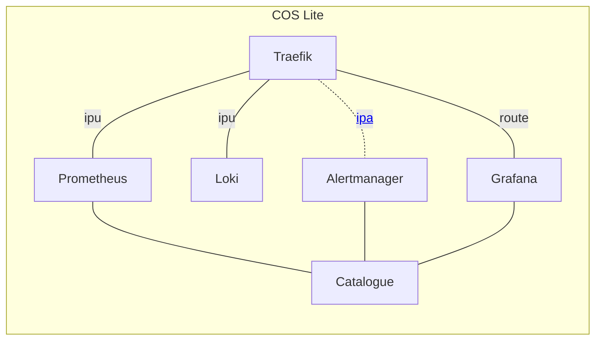
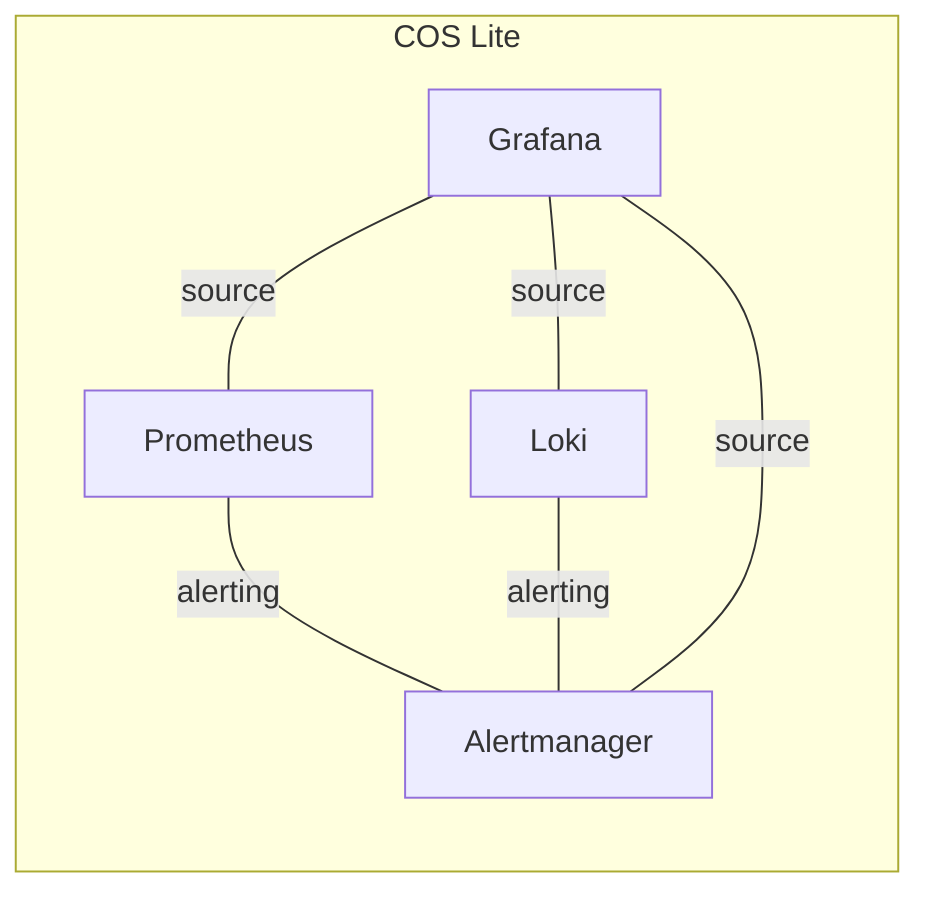
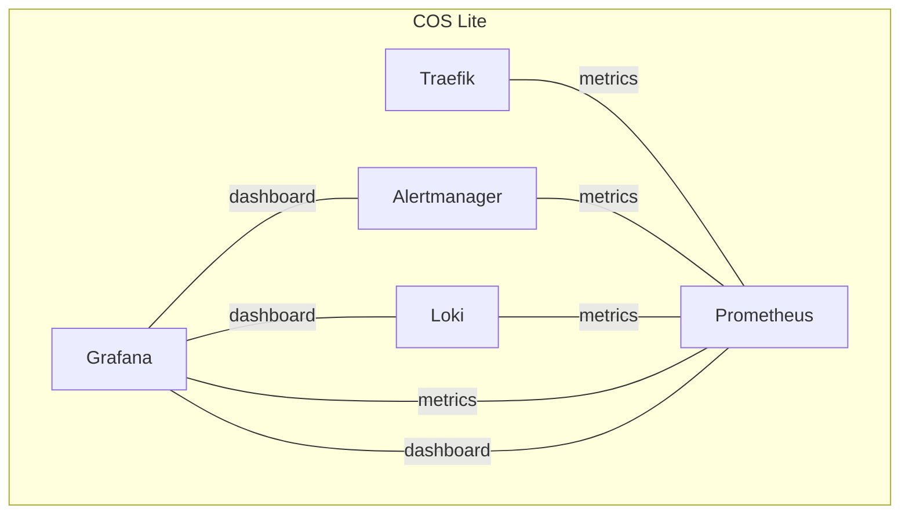

# Bundle topology
For clarity and readability, the bundle topology is depicted here using several separate diagrams.

## Externally

```mermaid
graph LR

subgraph cos_lite["COS Lite"]

  alrt[Alertmanager]
  click alrt "https://github.com/canonical/alertmanager-k8s-operator"
  
  graf[Grafana]
  click graf "https://github.com/canonical/grafana-k8s-operator"

  prom[Prometheus]
  click prom "https://github.com/canonical/prometheus-k8s-operator"

  loki[Loki]
  click loki "https://github.com/canonical/loki-k8s-operator"

  trfk[Traefik]
  click trfk "https://github.com/canonical/traefik-k8s-operator"

  ctlg[Catalogue]
  click ctlg "https://github.com/canonical/catalogue-k8s-operator"

  trfk --- |ipu| loki
  trfk --- |ipu| prom
  trfk --- |route| graf
  trfk -.- |<a href='https://charmhub.io/traefik-k8s/libraries/ingress'>ipa</a>| alrt

  prom --- ctlg
  alrt --- ctlg
  graf --- ctlg

end
```

## Internally

```mermaid
graph LR

subgraph cos_lite["COS Lite"]

  alrt[Alertmanager]
  click alrt "https://github.com/canonical/alertmanager-k8s-operator"
  
  graf[Grafana]
  click graf "https://github.com/canonical/grafana-k8s-operator"

  prom[Prometheus]
  click prom "https://github.com/canonical/prometheus-k8s-operator"

  loki[Loki]
  click loki "https://github.com/canonical/loki-k8s-operator"

  prom --- |alerting| alrt
  loki --- |alerting| alrt
  graf --- |source| prom
  graf --- |source| alrt
  graf --- |source| loki
end
```

## Self-monitoring

```mermaid
graph TD

subgraph cos_lite["COS Lite"]

  alrt[Alertmanager]
  click alrt "https://github.com/canonical/alertmanager-k8s-operator"
  
  graf[Grafana]
  click graf "https://github.com/canonical/grafana-k8s-operator"

  prom[Prometheus]
  click prom "https://github.com/canonical/prometheus-k8s-operator"

  loki[Loki]
  click loki "https://github.com/canonical/loki-k8s-operator"

  trfk[Traefik]
  click trfk "https://github.com/canonical/traefik-k8s-operator"

  trfk --- |metrics| prom
  alrt --- |metrics| prom
  loki --- |metrics| prom
  graf --- |metrics| prom

  graf --- |dashboard| loki
  graf --- |dashboard| prom
  graf --- |dashboard| alrt
end

```
