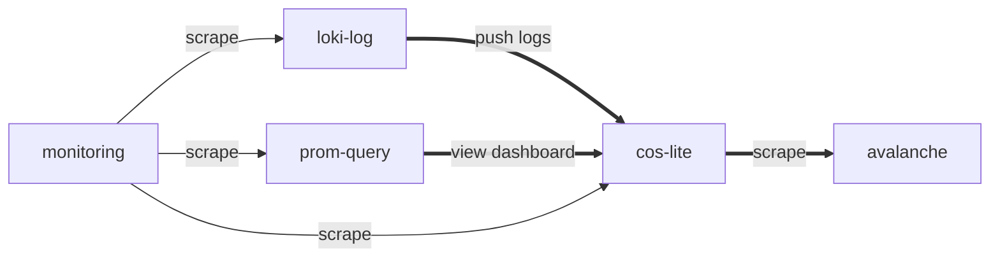

## Load tests on Google Cloud Platform (GCP)

The purpose of these load tests is to produce performance anchors for cos-lite
operating as a standalone appliance, for the following resource matrix:

| Disk type | vCPUs | Mem, GB |
|:---------:|:-----:|:-------:|
|   ssd     |   2   |    4    |
|   ssd     |   2   |    8    |
|   ssd     |   4   |    8    |
|  standard |   2   |    4    |
|  standard |   2   |    8    |
|  standard |   4   |    8    |

## Set up a GCP project

1. [Create a new project](https://console.cloud.google.com/cloud-resource-manager)
   and name it e.g. `cos-lite-load-testing`. Note the Project ID (e.g. `stunning-vertex-342218`).
2. Export a JSON credentials file ([Credentials](https://console.cloud.google.com/apis/credentials)
  - Create credentials -> Service account.
  - "Service account name" can be e.g. "tf-load-test".
  - "Role" can be Basic -> Editor.
  - Manage keys -> Add key -> Create new key -> JSON -> Save it in e.g.
    `~/secrets/stunning-vertex-342218-e123456abcde`.
  - Enable "[Compute Engine API](https://console.developers.google.com/apis/api/compute.googleapis.com/overview?project=986404459234)"

### Generate SSH keys to be used with the GCP VMs
SSH keys are handy for avoiding manual passwords.

To generate a public-private key pair,

```shell
ssh-keygen -t rsa -b 4096 -f ~/secrets/cos-lite-load-testing-ssh -C ""
```

The public key will later be pushed into the VM and the private key will be
used for provisioning files and ssh-ing into the VM.

## Set up development environment

The following steps can be completed on your host, or inside a VM:

```shell
multipass launch --mem 8G --cpus 2 --disk 50G --name load-test jammy --mount ~/secrets:/home/ubuntu/secrets --mount ~/code:/home/ubuntu/code
multipass shell load-test
```

```shell
sudo snap install --classic google-cloud-sdk
sudo snap install --classic terraform
cd ~/code/cos-lite-bundle/tests/load/gcp/
terraform init
gcloud auth login
gcloud config set project cos-lite-load-testing
```

Confirm the following variables are up-to-date:
- [variables.tf](variables.tf):
  - `project`
- [provider.tf](provider.tf):
  - `gcp_credentials`
  - `ssh_public_key`
  - `ssh_private_key`

## Provision the load test using terraform

The very first time you run terraform,

```shell
terraform init -upgrade
```

To start a load test:

```shell
terraform apply -var-file="var_ssd-4cpu-8gb.tfvars"

# or, override some of the variables

terraform apply -var-file="var_ssd-2cpu-8gb.tfvars" -var="ncpus=4" -var="gbmem=16"

# or, do not use a var-file at all

terraform apply -var="disk_type=pd-ssd" -var="num_avalanche_targets=3" -var="ncpus=2" -var="gbmem=8"
```

which will the following vm instances:
- avalanche (prom-scrape)
- loki-log
- pd-ssd-2cpu-8gb
- prom-query



To enable pushing monitoring data to grafana cloud, create
[var](var_grafana_cloud.tfvars) using the
[provided example](var_grafana_cloud.example.tfvars) and include it in the
`apply` command:

```shell
terraform apply -var-file="var_grafana_cloud.tfvars" -var-file="var_ssd-2cpu-8gb.tfvars"
```


Similarly, to force a replacement of a certain vm,

```shell
terraform apply -var-file="var_ssd-2cpu-8gb.tfvars" -replace=google_compute_instance.vm_loki_log
```

To destroy,

```shell
terraform destroy -var-file="var_ssd-2cpu-8gb.tfvars"
```

Note that only one load test can run at a time. This is because terraform does not support
parametrizing resource names.

To ssh into a vm instance,

```shell
ssh -i ~/secrets/cos-lite-load-testing-ssh \
  -o "UserKnownHostsFile=/dev/null" \
  -o "StrictHostKeyChecking no" \
  ubuntu@$(terraform output ip_nat_vm_cos_lite_appliance | xargs -n1 echo)
```


### Web interfaces
There is already an [ingress in place](cos-lite.tpl.conf) via traefik in the COS bundle,
which maps the following subpaths to their corresponding ports:
- `cos-lite-load-test-prometheus-0`,
- `cos-lite-load-test-loki-0` and
- `cos-lite-load-test-grafana`.

To use their web interfaces from your local machine, use ssh tunneling by
adding a `-L` argument to the `ssh` command above:

```shell
ssh -i ~/secrets/cos-lite-load-testing-ssh \
  -o "UserKnownHostsFile=/dev/null" \
  -o "StrictHostKeyChecking no" \
  -L 8080:localhost:80 \
  ubuntu@$(terraform output ip_nat_vm_cos_lite_appliance | xargs -n1 echo)
```

After this the various endpoints would be available on your local machine as:
- `127.0.0.1:8080/loki-0/loki/api/v1/rules`
- `127.0.0.1:8080/prometheus-0/api/v1/alerts`
- `127.0.0.1:8080/grafana`
