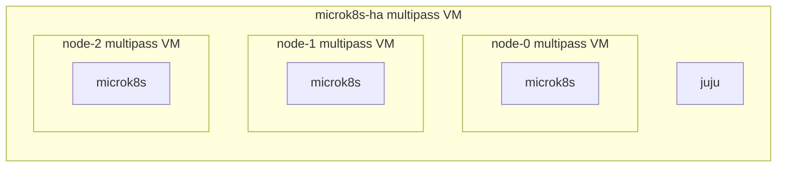

# Manual tests

## 3-node cluster in a multipass VM (nested virtualization)
The [`microk8s-ha.yaml`](microk8s-ha.yaml) file contains a cloud-init script
for an "all in one" VM. When launched the VM will have three nested VMs called
"node-1", "node-2" and "node-3".



Launch the VM with:
```bash
multipass launch 22.04 --cloud-init microk8s-ha.yaml \
 --timeout 2000 \
 --name three-node \
 --memory 32G \
 --cpus 16 \
 --disk 160G
```

Then shell into the vm, get the `three-nodes-overlay.yaml` file and run:
```bash
juju deploy --trust cos-lite --overlay ./three-nodes-overlay.yaml
```

From within the "outer VM" you can `multipass exec` into the node VMs:
```bash
multipass exec node-1 microk8s.kubectl -n welcome-k8s get pods -A
```

Note that with Juju <3.3.5,<3.4.4, you would need to manually patch the
statefulsets due to a [bug](https://bugs.launchpad.net/juju/+bug/2062934).

## CMR to Ceph with Grafana-agent
The `lxd-ceph-quincy.yaml` file contains a bundle for deploying Ceph with grafana-agent (subordinate) on a LXD model.

Validation Process
1. Deploy COS-lite in microk8s with `juju deploy cos-lite --trust --overlay ./offers-overlay.yaml`. Then relating:
```
- grafana-agent:send-remote-write <-> prom:receive-remote-write
- grafana-agent:grafana-dashboards-provider <-> graf:grafana-dashboard
```
2. Open the Grafana UI with:
`juju run traefik/0 show-proxied-endpoints --format=yaml | yq '."traefik/0".results."proxied-endpoints"' | jq`
`juju run grafana/leader get-admin-password`
3. Navigate to `Home/Dashboards` and check that Ceph dashboards exist and have populated data.